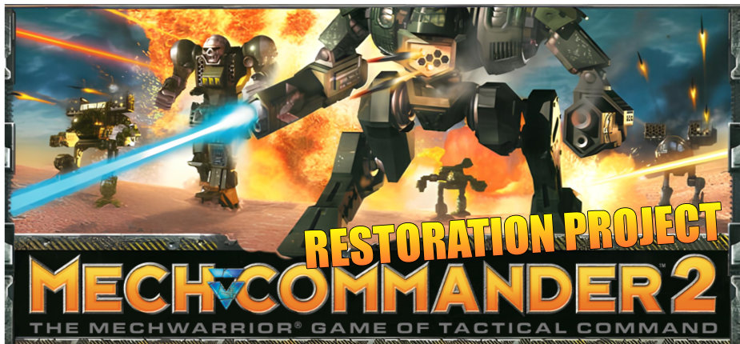

# MechCommander 2 Restoration Project

A community effort to become the definitive way to play **MechCommander 2**
(Microsoft Game Studios, 2001) on modern systems. Built on [alariq's
open-source port](https://github.com/alariq/mc2) of Microsoft's
[shared-source engine release](https://github.com/microsoft/MechCommander2),
this fork works toward three goals, in roughly that order of priority:

1. **Make the game reliably playable on Windows 11** — fix the crashes,
   compatibility breakages, and dead dependencies that keep the 2001 binary
   from running on a current OS out of the box.
2. **Improve performance and quality of life** wherever it's worth the cost —
   renderer modernization, startup behaviour, resource handling, and so on.
3. **Keep Linux working** — the upstream port builds and runs on Linux, and
   that capability is preserved here. It isn't the current focus, but we
   avoid regressing it, and it'll be revisited.

The project is distributed as an **installer that patches a legal retail
MechCommander 2 install**. No game assets are redistributed — the installer
lays down the patched binary and supporting files alongside your existing
retail data, with `Mc2Rel.exe` required as the license anchor.

## Status

Completed and verified:

- **Modern FMV playback** — the original Bink video codec is end-of-life and
  fails on modern Windows. This project replaces it with an FFmpeg/MP4
  pipeline that handles the intro, in-mission cinematics, mission briefings,
  pilot portraits, and credits through a single decode path.
- **Retail-patch installer** — wizard with registry-based install-dir
  autodetect, license-anchor validation, license-preserving uninstall, and
  in-place `.bik` → `.mp4` transcode of the movie files on install.
- **Windows 11 verification** — confirmed running from end to end on a clean
  retail install of MechCommander 2 on Windows 11 64-bit.

In progress / on deck:

- Additional compatibility fixes and crash hardening as issues surface.
- Performance work (renderer call counts, lighting, resource hot-paths).
- **Mission editor revival.** MC2 shipped with a full mission editor —
  Microsoft released its source in the 2001 shared-source drop. It's MFC-
  based and hasn't been brought forward to modern toolchains by any fork
  yet. Near-term goal: get it building with VS 2022 and current MFC so
  players can author custom missions again.
- Font-rendering quality regression — the current shipping font set is worse
  than retail's originals; a one-shot tool to convert retail glyph atlases
  back into the engine's expected format is planned.
- Auto-detecting display resolution on first launch instead of the current
  hardcoded 1080p.
- Linux: revisit build instructions and verify nothing regressed after the
  Windows-side work lands.

Tracked in more detail under `devlogs/` and the top-level `claude.md`
follow-ups list.

## For players

*Public release is staged but not yet published.* Once it is:

1. Install **retail MechCommander 2** (you must own a legal copy — the
   installer refuses to proceed without `Mc2Rel.exe` present in the target
   directory).
2. Download the installer from the Releases page.
3. Run it. Point the wizard at your MechCommander 2 install directory when
   prompted — it autodetects the usual locations.
4. Launch from the new Start-menu shortcut.

The installer is fully reversible. Uninstalling restores the original `.bik`
videos from a local backup and removes only the files this patch placed.

## For modders

Want to make a custom campaign with your own mission sequencing and video
briefings, without touching engine code? See [`CUSTOM-CAMPAIGNS.md`](CUSTOM-CAMPAIGNS.md).
It walks through the campaign `.fit` format, includes a copy-paste 3-mission
template, and notes the relevant engine entry points. No build required —
drop a single `.fit` file into `data/campaign/` and your campaign shows up
in the New Campaign list next to Carver V.

Custom missions, units, terrain, and videos are beyond data-only modding
and need the mission editor to be usable — revival plan tracked under
`devlogs/`.

## For developers

If you want to build from source:

1. Clone this repo.
2. Extract `3rdparty.zip` to `3rdparty/` in the repo root.
3. Follow the detailed steps in [`BUILD-WIN.md`](BUILD-WIN.md) (Visual Studio
   2022, CMake, x64). Short version:

   ```
   mkdir build64 && cd build64
   cmake -G "Visual Studio 17 2022" -DCMAKE_PREFIX_PATH="$PWD/../3rdparty" -DCMAKE_LIBRARY_ARCHITECTURE=x64 ..
   cmake --build . --config Release --target mc2
   ```

   Build output copies itself to `full_game/mc2.exe` for testing.

Game data (maps, missions, assets) lives in a separate repository:
[alariq/mc2srcdata](https://github.com/alariq/mc2srcdata). That's where you
point a full from-source setup if you are not overlaying this patch onto a
retail install.

Linux builds follow roughly the same flow; see `BUILD-WIN.md` and upstream
docs for details.

## Credits

- **Microsoft Game Studios** — [original MechCommander 2 engine source
  release](https://github.com/microsoft/MechCommander2), without which none
  of this would exist.
- **alariq** — [the open-source port](https://github.com/alariq/mc2): OpenGL
  renderer, Linux support, and the overwhelming majority of bug fixes
  carried forward into this fork.
- **This fork** — FMV pipeline rewrite, installer, compatibility and crash
  fixes on the Windows 11 path. Work in progress; contributions welcome via
  pull request.

## Licensing

- Original game code is covered by Microsoft's **Shared Source Limited
  Permission License** — see [`EULA.txt`](EULA.txt).
- Original port and this fork's contributions are licensed under **GPLv3** —
  see [`license.txt`](license.txt).
- Third-party libraries (SDL2, FFmpeg, GLEW, zlib, etc.) retain their own
  licenses.

## Reporting issues

- Crashes or regressions: open an issue with `mc2_stdout.log` attached
  (next to `mc2.exe` in the install directory — it is overwritten each run,
  so grab it before relaunching).
- Build failures: please include your OS, toolchain, and the CMake
  configuration output.
